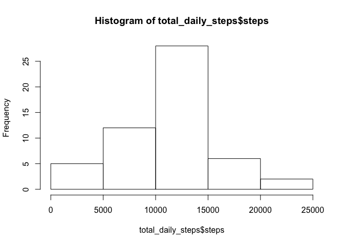
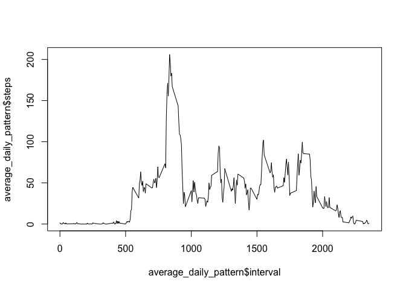
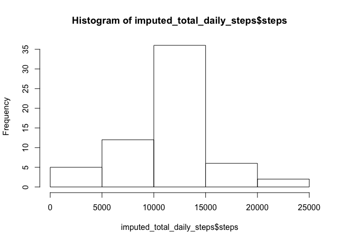
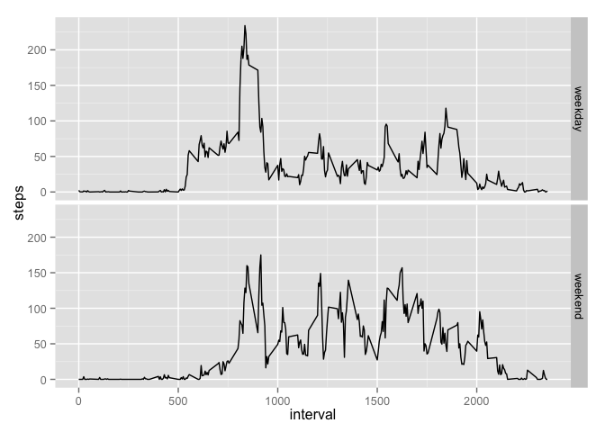

# Reproducible Research: Peer Assessment 1


## Loading and preprocessing the data
Let's first check to see if our unzipped version exists.  If it doesn't, unzip
the datafile.  Once we have the CSV file, read the data into a data frame.

```r
if(!file.exists("activity.csv")){
  unzip("activity.zip")
}
data <- read.csv("activity.csv")
```
Let's convert the dates to timestamps. If we needed to later, we could translate
the intervals to further refined timestamps.

```r
data$timestamp <- as.POSIXct(strptime(data$date, "%Y-%m-%d"))
```

## What is mean total number of steps taken per day?

```r
total_daily_steps <- aggregate(steps ~ date, data, sum)
hist(total_daily_steps$steps)
```

 

The mean of total daily steps:

```r
print(mean(total_daily_steps$steps))
```

```
## [1] 10766.19
```

The median of total daily steps:

```r
print(median(total_daily_steps$steps))
```

```
## [1] 10765
```

## What is the average daily activity pattern?
The daily pattern of activity is as follows:

```r
average_daily_pattern <- aggregate(steps ~ interval, data, mean)
plot(average_daily_pattern$interval, average_daily_pattern$steps, type="l")
```

 

On average, the most active five-minute interval is:

```r
sorted_daily_pattern <- average_daily_pattern[order(
                                              -average_daily_pattern$steps),]
max_interval <- sorted_daily_pattern$interval[1]
print(max_interval)
```

```
## [1] 835
```

## Imputing missing values
There are a lot of missing values in the dataset.  In total:

```r
total_na_samples <- sum(is.na(data$steps))
```

We can impute these missing values by looking at the average daily pattern and
fill in the missing values with the average for that interval.  We'll use the
average_daily_pattern previously computed.

```r
# Create a function where we can apply the mean from the previously computed
# dataframe to a new dataframe
fill_funct <- function(x){
  if(is.na(x["steps"])){
    return(average_daily_pattern[
      average_daily_pattern$interval == x["interval"], "steps"])
  }else{
    return(x["steps"])
  }
}
imputed_data <- data
imputed_data$steps <- apply(imputed_data[,c("steps","interval")], 1, fill_funct)
imputed_total_daily_steps <- aggregate(steps ~ date, imputed_data, sum)
```

Let's compare what this imputing did to our previous observations for the total
number of steps per day.

```r
hist(imputed_total_daily_steps$steps)
```

 

The mean of total daily steps after imputing data:

```r
print(mean(imputed_total_daily_steps$steps))
```

```
## [1] 10766.19
```

The median of total daily steps after imputing data:

```r
print(median(imputed_total_daily_steps$steps))
```

```
## [1] 10766.19
```

From the mean and median printed above, we can see that after imputing data,
there is not a significant change from the original dataset mean and median.


## Are there differences in activity patterns between weekdays and weekends?
We can see the differences between weekday and weekend activity by finding out
what day of the week a sample was taken, then group whether or not that day is
during the weekend.  The plot shows average activity during weekdays and during
weekend days.

```r
library("ggplot2")
data$dow <- factor(weekdays(data$timestamp, TRUE))
data$weekend <- data$dow == "Sun" | data$dow == "Sat"
data$weekend <- factor(data$weekend)
levels(data$weekend) <- c("weekday", "weekend")
average_daily_pattern <- aggregate(steps ~ weekend + interval, data, mean)
qplot(interval, steps, data=average_daily_pattern, facets=weekend~. ,geom=("line"))
```

 


